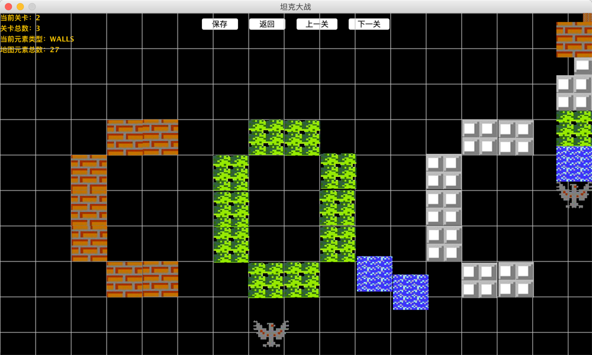
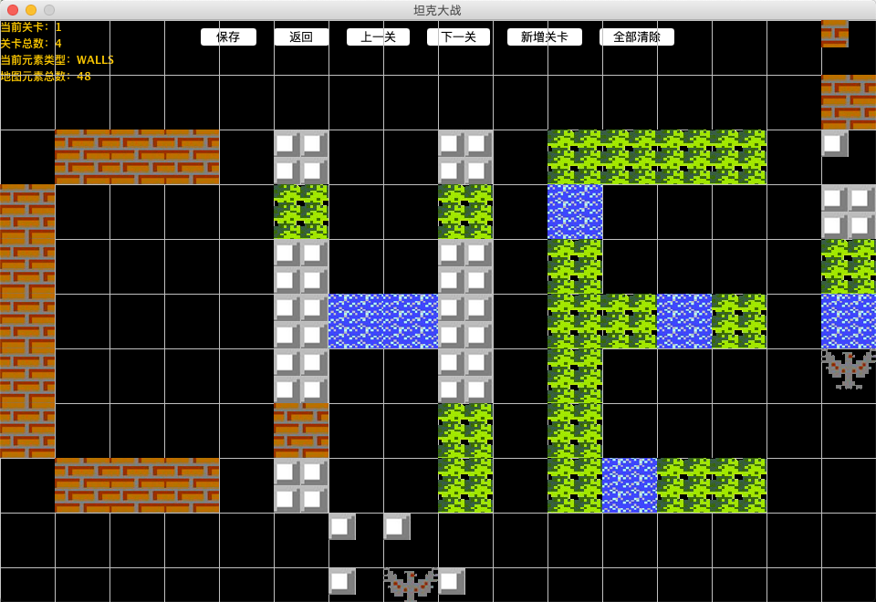
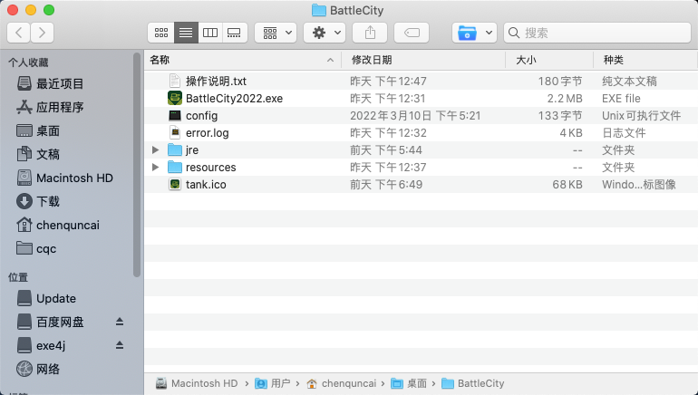

# Tank War
Battle City 2022

# 坦克大战功能完善
## 1.碰撞检测及碰撞后处理
### 1）坦克和坦克相撞
1.玩家坦克与敌方坦克相撞：
如果坦克下一步将与另一坦克相撞(需提前一步检测，否则坦克将无法再移动)，玩家坦克不动，敌方坦克也不懂；☑️

2.玩家坦克与玩家坦克相撞，同上； TODO

3.敌方坦克与敌方坦克相撞，敌方坦克将换个方向；☑️

### 2）坦克与子弹相撞
1.坦克与子弹相撞，坦克爆炸(己方坦克与己方子弹碰撞无效)，子弹也消失；☑️

### 3）坦克撞墙
1.玩家坦克，停止(坦克撞墙前一个(x,y)坐标先进行碰撞检测，如果碰撞，坦克不再向前)；☑️

2.敌方坦克撞墙；☑️

### 4）子弹撞墙
1.玩家子弹撞墙，子弹和墙都消失(有爆炸效果💥)；  TODO

2.敌方坦克子弹撞墙，子弹消失； TODO

## 2.画出第一关完整地图

坦克、玩家基地老鹰🦅、墙、河流、草地

### 20220226
坦克与墙体碰撞检测及碰撞后处理；
玩家坦克与敌方坦克碰撞检测及碰撞后处理；

### 20220301 - 坦克大战第二版
将第一版整个代码重构，如下更新：

1.添加一个地图编辑功能;

2.添加游戏选择界面；

3.添加游戏准备界面；

### 20220305
1.添加自定义地图编辑功能；

已实现功能描述：

1）鼠标左键单击或拖拽右侧边栏地图元素，进行地图元素添加；

2）鼠标左键双击，移除选中地图元素；

3）点击保存按钮：编辑好的地图保存成功或保存失败；

4）点击返回按钮：直接返回上一个界面；

### 20220306
实现功能：

1）自定义地图生成后的保存，读取功能；

2）自定义地图界面可选择上一关，下一关；

3）自定义地地图，侧边栏添加基地老鹰；

## 操作说明 - 20220314

1.上下左右：wsad;

2.子弹发射：j;

3.地图编辑：

1）点击侧边栏选中地图元素，左键单击选中元素；

2）左键长安拖拽鼠标，快速编辑元素；

3）右键去除元素；

4）支持编辑已有地图，也可以点击【新增关卡】新增地图；

1.优化游戏画面，添加道具（道具特效还未实现）；

2.优化地图编辑界面功能；

3.将游戏打包成exe文件；

